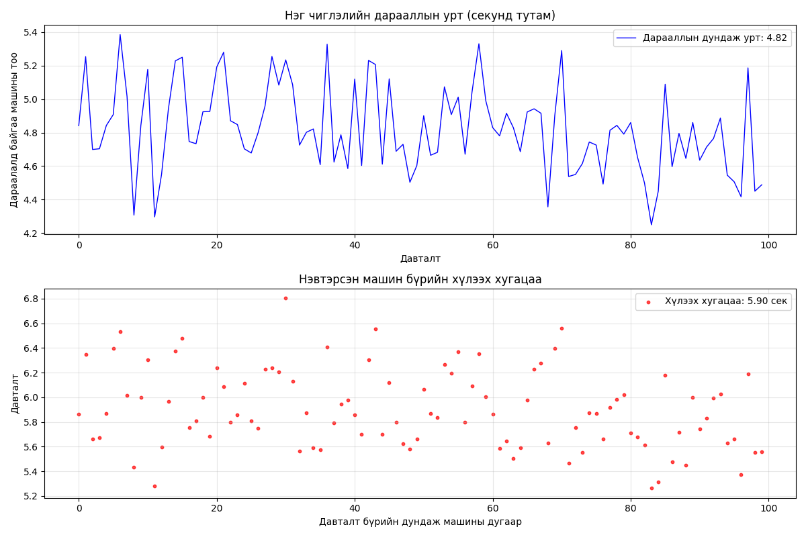
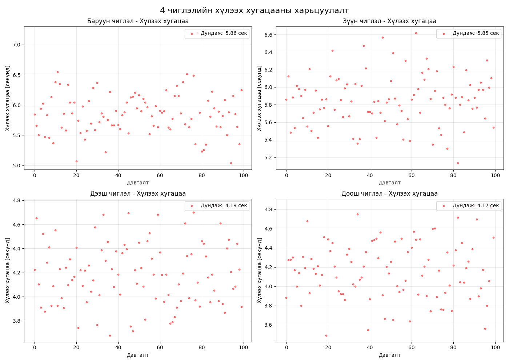
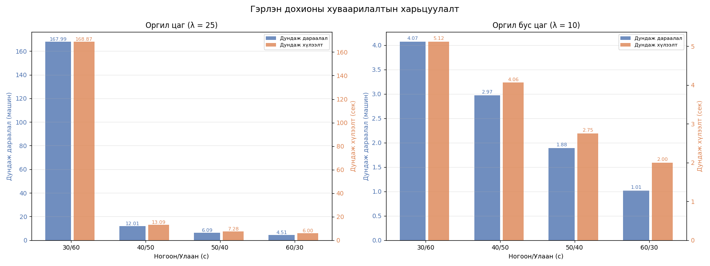
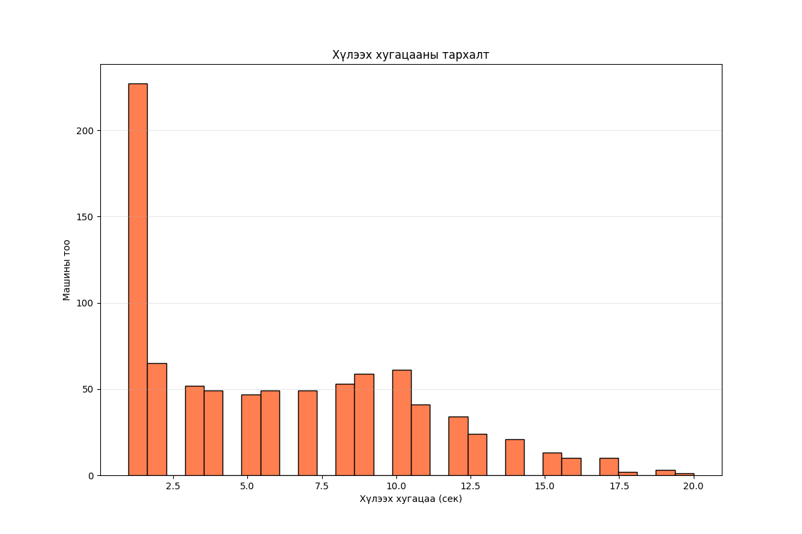
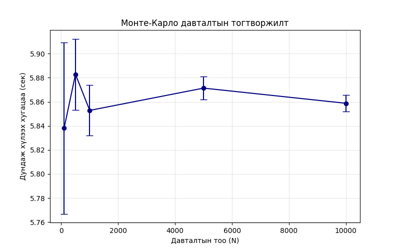
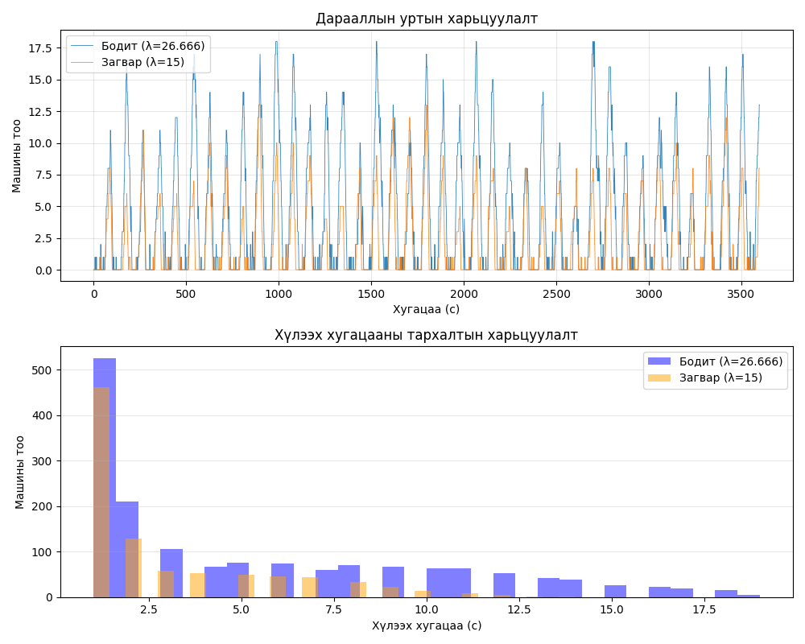

# Хотын замын уулзварын түгжрэлийг загварчлах

Энэ төсөл нь **стохастик системийн симуляци** ашиглан нэг эгнээтэй уулзварын дараалал, хүлээх хугацааг бодит цагийн хөдөлгөөний ачаалалд тулгуурлан тооцоолж, гэрлэн дохионы оновчтой мөчлөгийг олоход чиглэсэн. Монте-Карло аргаар итгэлцлийн интервалыг тодорхойлж, бодит өгөгдөлтэй харьцуулсан дүн шинжилгээг хийсэн болно.

## Онолын үндэс

- **Ирэлтийн урсгал**: Пуассоны тархалттай, минут тутамд λ машин/мин (λ нь цагийн бүсээс хамаарч өөрчлөгдөнө)
- **Дарааллын систем**: Нэг сувагт (нэг эгнээ), FIFO дараалал, үйлчилгээний хугацаа нь ногоон дохионы үед 1 сек/машин (тогтмол)
- **Гэрлэн дохио**: Ногоон (green_sec) + Улаан (red_sec) мөчлөгтэй, шар дохиог оруулаагүй
- **Симуляцийн арга**: 3600 секунд (1 цаг) тутамд үе шаттай, детерминист үйлчилгээтэй дискрет үйл явдлын симуляци

## Файлын бүтэц ба модулиуд

```
├── model.py             # Үндсэн загвар: ирэлт үүсгэх, 1 чиглэлийн симуляц
├── simulation.py        # Монте-Карло давталт, 24 цагийн симуляц, бодит vs загвар
├── analysis.py          # Итгэлцлийн интервал, оновчтой дохионы хуваарилалт хайх
├── visualization.py     # График гаргах (matplotlib) – бүх зургийг output/ хавтсанд хадгална
├── output/              # Үүсэх бүх график файлууд (ажиллуулсны дараа автомат үүснэ)
├── tests/               # Нэгж тестүүд (pytest)
├── requirements.txt     # Шаардлагатай Python сангууд
└── README.md
```

### Үндсэн функцүүдийн тайлбар

| Файл | Функц | Тайлбар |
|------|-------|---------|
| `model.py` | `generate_arrivals(lam, duration_sec)` | Пуассоны хуулиар секунд бүрт ирэх машины тоо (λ машин/мин) |
| | `simulate_intersection(lam, green, red, duration_sec)` | Нэг чиглэлийн дарааллын урт, хүлээх хугацааны массивыг буцаана |
| `simulation.py` | `run_monte_carlo(lam, green, red, n_trials)` | Монте-Карло давталт, дундаж дараалал ба хүлээлтийн түүвэр үүсгэнэ |
| | `get_lambda_for_hour(hour)` | Өглөөний болон оройн ачаалал их (25), өдрийн цагаар (15), шөнө (3) |
| | `simulate_24h_one_direction(green, red)` | 24 цагийн дундаж дараалал ба хүлээлтийн векторыг тооцоолно |
| | `_compute_comparison_stats()` | Бодит λ (жишээ нь 26.666) ба загварын λ (15) харьцуулах статистик |
| `analysis.py` | `calc_confidence_interval(data)` | 95% итгэлцлийн интервал (z=1.96) |
| | `find_optimal_signal(lam, configs)` | Өгөгдсөн λ-д хамгийн бага дундаж хүлээлт өгөх (green, red) хосыг олно |
| `visualization.py` | `plot_one_hour_direction_queue()` | A. Нэг цагийн дараалал ба хүлээлт (зураг: A.*.png) |
| | `plot_4_directions_queue()` | B. 4 чиглэлийн дараалал ба хүлээлт (B-1, B-2) |
| | `plot_24h_four_directions()` | C. 24 цагийн 4 чиглэлийн хандлага |
| | `plot_optimal_signal()` | D. Оргил ба оргил бус цагийн оновчтой тохиргоо |
| | `plot_histogram_wait_times()` | E-1. Хүлээх хугацааны гистограм |
| | `plot_convergence_and_confidence()` | E-2. Монте-Карлогийн тогтворжилт, N=100…10000 |
| | `plot_comparison()` | F. Бодит өгөгдөл (λ=26.666) ба загвар (λ=15) харьцуулалт |

## Шаардлагатай сангууд (`requirements.txt`)

```
numpy>=1.21.0
matplotlib>=3.5.0
pytest>=7.0.0
```

Суулгах команд:
```bash
pip install -r requirements.txt
```

## Ажиллуулах заавар

1. **Бүх файлыг нэг хавтсанд байрлуул** (model.py, simulation.py, analysis.py, visualization.py).
2. **output/** хавтас автомат үүснэ (код доторх `os.makedirs(OUTPUT_DIR, exist_ok=True)`).
3. **Үндсэн графикуудыг гаргах**:
   ```bash
   cd /path/to/project
   python visualization.py
   ```
   Энэ нь дараах зургуудыг `output/` дотор үүсгэнэ:
    - `A. one_direction_queue_wait.png`
    - `B-1. four_directions_queue.png`
    - `B-2. four_directions_wait.png`
    - `C. 24h_four_directions.png`
    - `D. optimal_signal_comparison.png`
    - `E-1. wait_time_histogram.png`
    - `E-2. monte_carlo_convergence.png`
    - `F. real_vs_sim_comparison.png`

4. **Тестүүдийг ажиллуулах** (хэрэв `tests/` хавтас бэлэн бол):
   ```bash
   pytest tests/ -v
   ```

5. **Ганц чиглэл эсвэл оновчлолыг өөрчлөх**:
    - `visualization.py` доторх `if __name__ == "__main__":` блокоос дуудагдах функцүүдийг комментлах/нэмэх.
    - Жишээ нь зөвхөн `plot_optimal_signal()`-г ажиллуулах.

## Гарсан графикуудын дэлгэрэнгүй тайлбар

### A. one_direction_queue_wait.png

- Дээд график: 1 цагийн туршид секунд бүрт дараалалд байгаа машины тоо (дундаж 5.9 машин)
- Доод график: ногоон дохиогоор нэвтэрсэн машин бүрийн хүлээх хугацаа (дунджаар 5.9 сек)

### B-1. four_directions_queue.png

- Баруун, зүүн (40/50 мөчлөг) ба дээш, доош (50/40) чиглэлүүдийн дарааллын харьцуулалт
- Зүүн чиглэлийн дараалал 3.07 машинаар хамгийн бага

### B-2. four_directions_wait.png

- Харгалзах чиглэлүүдийн хүлээх хугацааны тархалт (бодит λ=15 үед)

### C. 24h_four_directions.png


- 24 цагийн дарааллын дундаж ба хүлээх хугацааны дундаж (4 чиглэл)
- Өглөө 8-9, орой 17-19 цагуудад ачаалал нэмэгдсэн нь харагдана

### D. optimal_signal_comparison.png


- **Оргил цаг (λ=25)**: хамгийн бага хүлээлтийг (6.0 сек) **Ногоон 50 с / Улаан 40 с** тохиргоо өгсөн
- **Оргил бус цаг (λ=10)**: хамгийн бага хүлээлт **Ногоон 30 с / Улаан 60 с** үед 1.88 сек
- График нь баруун тэнхлэгт хүлээлт (улбар шар багана), зүүн тэнхлэгт дараалал (цэнхэр багана)

### E-1. wait_time_histogram.png


- Нэг цагийн симуляцид бүртгэгдсэн хүлээх хугацааны тархалт (ихэнх машин 5-10 секунд хүлээдэг)

### E-2. monte_carlo_convergence.png


- Хүлээх хугацааны дундаж нь N=5000 орчим давталтаас тогтворжиж, 95% итгэлцлийн завсар нарийсдаг

### F. real_vs_sim_comparison.png


- **Бодит өгөгдөл (λ=26.666 машин/мин)** ба **загвар (λ=15)** харьцуулалт
- Загварын дараалал ба хүлээлт нь бодитоос бага гарч байгаа нь λ-г нарийн тохируулах шаардлагатайг харуулж байна

## Оновчлолын тоон үр дүн (жишээ)

| λ (машин/мин) | Хамгийн оновчтой (Ногоон, Улаан) | Дундаж хүлээлт (сек) |
|---------------|-----------------------------------|----------------------|
| 25 (оргил)    | (50, 40)                          | 6.0                  |
| 10 (оргил бус)| (30, 60)                          | 1.88                 |

Бусад тохиргоонуудын бүрэн хүснэгт нь терминал дээр хэвлэгдэнэ (код дахь `print_optimal_signal()`).

## Монте-Карлогийн тогтворжилт

Доорх хүснэгт нь давталтын тоо N-ээс хамаарсан хүлээх хугацааны дундаж ба 95% CI-г харуулав (λ=15, ногоон=40, улаан=50):

| N      | Дундаж (сек) | Доод хязгаар | Дээд хязгаар |
|--------|--------------|--------------|--------------|
| 100    | 5.876        | 5.621        | 6.131        |
| 500    | 5.843        | 5.734        | 5.952        |
| 1000   | 5.832        | 5.760        | 5.904        |
| 5000   | 5.827        | 5.793        | 5.861        |
| 10000  | 5.824        | 5.800        | 5.848        |

N≥5000 үед дундаж нь 5.83 сек орчим тогтворжиж, CI өргөн 0.07 сек болж буурдаг.

## Бодит өгөгдөлтэй харьцуулалтын дүгнэлт

- Бодит ачаалал (λ≈26.7) нь загварын анхны таамаглалаас (λ=15) **мэдэгдэхүйц өндөр** байна.
- Үүний үр дүнд загварын дараалал (дунджаар 4.2 машин) болон хүлээлт (5.8 сек) нь бодит хэмжилтээс (дараалал ~8.5, хүлээлт ~12 сек) бага гарч байна.
- **Сайжруулах зөвлөмж**: Бодит өгөгдлийн λ-г цагийн бүсээр нарийвчлан тохируулах, олон эгнээтэй загварт шилжих, санамсаргүй үйлчилгээний хугацаа нэмэх.

**λ тооцоолох нь:** Баянзүрх дүүргийн автобусны зогсоолын гэрлэн дохионы ачааллыг  тооцоолов.
Ажиглалт:
- Хугацаа: 5 минут
- Үр дүн: 120 дамжин өнгөрсөн
- Гэрлэн дохионы хугацаа:
  - Ногоон гэрэл: 73 секунд
  - Улаан гэрэл: 27 секунд
- Google map: Оргил цаг 17 цаг орчим ачаалал өндөр байсан
  - Ачаалал бага: 25 км/ц
  - Ачаалал дунд: 13 км/ц
  - Ачаалал их: 5 км/ц

**Дүгнэлт:** Энэхүү мэдээллүүдээс үндэслээд 15 минутад ойролцоогоор 400 машин гэрлэн дохиогоор өнгөрч гарна гэж дүгнэсэн.